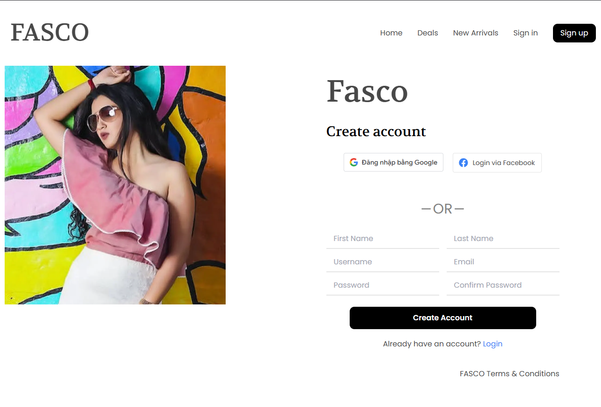
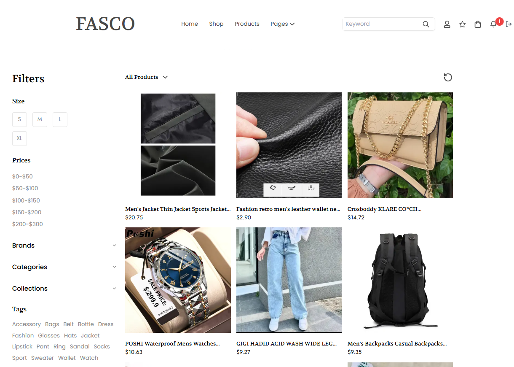

# 🚀 FASCO SHOP

> An e-commerce web app for a single vendor (Personal Project)

## 🌐 Demo

[fasco-shop.vercel.app](https://fasco-shop.vercel.app) 

## 🛠️ Tech Stack

- **Frontend:** ReactJs, NextJs, TailwindCSS, ShadcnUI, Redux
- **Backend:** Node.js, NestJs
- **Database:** PostgreSQL, Redis
- **Cloud:** Cloudinary
- **Others:** Docker, GoogleOAuth, FacebookOAuth, Socket.IO
  
## ⚙️ Installation

```bash
# Clone the repository
git clone https://github.com/phapnguyennhat/Fasco-Shop-FE.git

# Navigate to the project directory
cd Fasco-Shop-FE

# set up env
create file .env.local consist of 
BACKEND_URL=
GOOGLE_CLIENT_ID=
GOOGLE_CLIENT_SECRET=
NEXT_PUBLIC_FACEBOOK_CLIENT_ID=


# Install dependencies
npm install

# Run build the server
npm run build

# Run start
npm run start
```

## 🖋️ Figma Desgin UI

- Design by community not by me 🥲
- This design has not resposive and lack some page so I designed by myself

[Figma Link: ](https://www.figma.com/design/JGb0ulUpKRe43lG5smWi5Z/Online-Shopping-Website-Design---eCommerce-Store-Website---UI-Kit--Community-?node-id=0-1&t=z9RxL1RTsTo9QaRm-1) 


## 📦 Features

### 1. Sign in


### 2.Sign up


### 3. Search Product


### 4. Product Detail


### 5. Cart


### 6. Checkout


### 7. User/Order


### 8. Order Detail


### 9. Edit Address of Order
> user is allowed edit address if status is pending


### 10. User's Profile


### 11. Favorite Product


### 12. Notify


### 13. Home page for buyer and seller


### 14. Create Product


### 15. Delete Product


### 16. Edit Product


